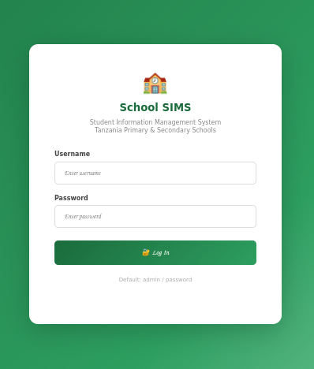

# 🏫 School Student Information Management System (SIMS)

> Open Source Technologies | University of Dodoma (UDOM)  
> College of Informatics and Virtual Education (CIVE)

---


## 📌 Project Overview

The **School Student Information Management System (SIMS)** is a PHP-based web application designed to manage student records for **primary and secondary schools in Tanzania**. It allows administrators and teachers to register students, browse all student records, and quickly search for a student by their registration number or other details.

The system includes a full **user management module** with role-based access (Admin and Teacher), session-based authentication, and a clean, responsive interface.

---

## 👨‍💻 Project Details

| Field              | Details                                      |
|--------------------|----------------------------------------------|
| **Course**         | CP 222 – Open Source Technologies            |
| **Degree Program** | Bachelor of Science in Computer Science      |
| **Institution**    | University of Dodoma (UDOM)                  |
| **College**        | College of Informatics and Virtual Education (CIVE) |
| **Academic Year**  | 2025/2026                                    |
| **Group**          | Group 04                                     |
| **Assignment**     | Lab Assignment – PHP Project with Git/GitHub |
| **Deadline**       | 18th June 2026                               |

---

## ✨ Features

- 🔐 **User Authentication** – Secure login/logout with session management
- 👥 **User Management** – Admin can add, view and delete system users (Admin/Teacher roles)
- 📝 **Student Registration** – Register primary and secondary school students with full details
- 📋 **Student Records** – View and filter all registered students by school level
- 🔍 **Search** – Search students by registration number, name, region, or class
- 👁 **Student Profile** – Detailed individual student view with parent contact info
- 📊 **Dashboard** – Summary stats and recent registrations at a glance
- 🗑 **Delete Records** – Admin-only student record deletion

---

## 🛠 Technologies Used

| Technology          | Purpose                              |
|---------------------|--------------------------------------|
| PHP 8.x             | Server-side scripting and logic      |
| MySQL               | Database for storing records         |
| HTML5 / CSS3        | Frontend structure and styling       |
| Apache (XAMPP)      | Local web server                     |
| Git & GitHub        | Version control and hosting          |

---

## ⚙️ Installation Steps

### Prerequisites
- XAMPP or WAMP installed (PHP + MySQL + Apache)
- Git installed
- ---

1.Download / Clone the Project
-Open your terminal (or Git Bash) and run:
```bash
git clone https://github.com/nova0408-glitch/OpenSource_Assignment_Bsc_CS2_Group_04.git
```
2.Copy Files to XAMPP
-Copy the entire student_system folder into XAMPP’s htdocs directory:<br>
```bash
C:\xampp\htdocs\student_system
```
3.Start XAMPP Services<br>
-Open XAMPP Control Panel.<br>
-Start Apache and MySQL.
<br> 
<br>
4.Create the Database<br>
-Open your browser and go to: http://localhost/phpmyadmin<br>
-Click on New → Create a database named school_db.<br>
-Select the school_db database → Click Import tab.<br>
-Choose the file: student_system/db/school_db.sql<br>
-Click Import at the bottom.
<br> 
<br>
5.Run the Application<br>
Open your browser and go to:<br>
```bash
http://localhost/student_system/
```
---
### Git Commands Used
```bash
git init
git add . 
git commit -m "Initial commit - Project setup" 
git commit -m "Added student registration and display features" 
git commit -m "Implemented search functionality" 
git commit -m "Added user management module"
git checkout -b development 
git commit -m "Added CSV export feature for students"
git checkout main 
git merge development --no-ff -m "Merged development branch with CSV export feature" 
git push origin main 
git push origin development

```
---
